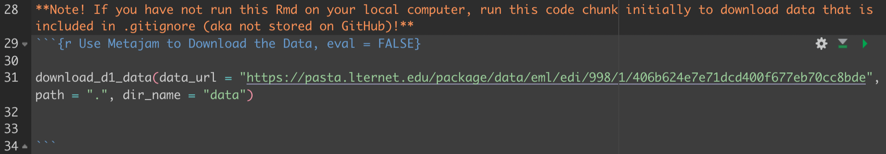

```{r setup, include=FALSE}
knitr::opts_chunk$set(echo = TRUE)
```

```{r, echo=FALSE}
library(xaringan)
```

#Our Question

**How do population demographic factors impact lead exposure in Philadelphia?**

- Developed from an interest in an EJ question
- DataONE had environmental health data for this question specifically from a 2021 published study 

---

#Data Management Plan

- **Data managers:** Alex Vand, Clarissa Boyajian, and Scout Leonard
- **Repository owner:** Scout Leonard (Clarissa and Alex are collaborators)
- This team effort calls two datasets: one which contains **lead risk factors for Philadelphia communities**, and another which contains **human demographic data.** 
  - 6 hours for the 2 datasets
  - Code to call/clean/combine data in our repo
- **Preservation plan:** We plan to save until the end of MEDS!
- No legal constraints. 

---

#Obtaining and Merging Data

- Data Retrieval
  - Public Health/Lead Data: `metajam` package
    - This uses an API to download the DataONE data
    - This creates the `metajam` log; stashed in our `.gitignore`
  - Census/demographic data: `censusapi` package
    - Requires an access token to control server traffic
    - `censusapi` package restricted us from pulling based on 1 county; we downloaded all of the data from state 42 before filtering
- Data Combination
  - Left joined datasets based on census tract
  - Census tract format required cleaning in lead dataset

```{r, echo=FALSE}

```


---

#Analysis and Results

- Winsorized to control for outliers
- OLS results showing 5% variation in EBLL is explained by median income

```{r Linear regression with winsorization, eval=FALSE}
median_income_95 <- quantile(
  lead_census_joined$acs_median_income_2019,
  probs = 0.95, na.rm = TRUE)

lead_census_joined <- lead_census_joined %>% 
  mutate(income_winsor = case_when(
    acs_median_income_2019 >= median_income_95 ~ median_income_95,
    acs_median_income_2019 < median_income_95 ~ acs_median_income_2019))

model <- lm(number_of_children_with_ebll_2015 ~ income_winsor,
            data = lead_census_joined)
model %>% summary()
```

---

#Future Analysis


For future analysis, we would recommend comparing multiple socioeconomic factors to individual lead risk factors or resulting health impacts as this would better show the complicated nature of how these various factors interact with each other.

---

##Data Preservation: KNB and Github
